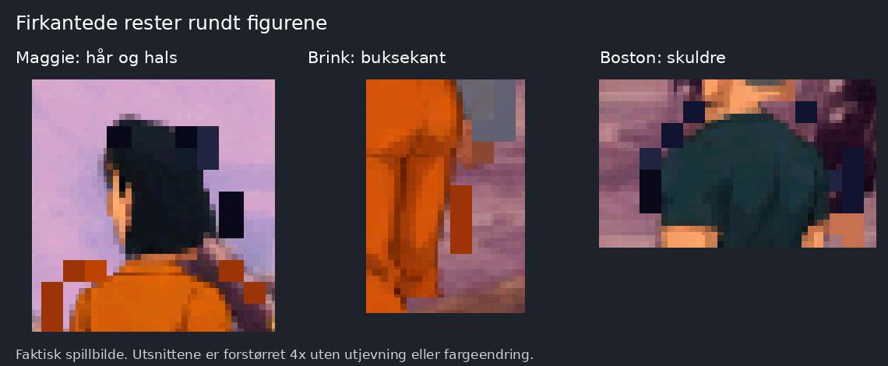

# Tillegg: firkantede rester rundt figurene

Dato: 10. oktober 2026. Tom melder at artefakter dukker opp innimellom, og har lagt ved et syvende faktisk spillbilde. Dette er en egen feil i tillegg til hodeplassering, størrelseshopp og Brinks utseende.

## Bekreftet i skjermbildet

- Maggie har store mørke, rettvinklede blokker på høyre side av håret, og oransje utspring ved hals og skuldre.
- Boston har mørke blokker utenfor den glatte konturen ved skuldrene og halsen.
- Brink har en løs, loddrett oransje stripe til høyre for buksen, under hånden.

Dette er tydelige synlige feil, ikke bare en svak lys eller mørk rand fra kantutjevning. Utsnittene er forstørret 4x med nærmeste nabo, uten endring av farger eller tegning. Originalen er bevart uendret i [skjermbilde-07.png](skjermbilde-07.png). Utsnittskoordinater og sjekksummer står i [artefakter-kilder.json](artefakter-kilder.json).

Tom beskriver feilen som periodisk. Ett bilde dokumenterer utseendet, men viser ikke hvilken animasjonsfase som utløste det, eller om blokkene kommer fra aktuell originalrute eller forrige bilde.

## Foreløpig årsaksvurdering

Formen og de flate figurrelaterte fargene ligner rester av originalfigurene som ikke blir skjult når HD-tegningen legges over. Alternativt kan deler av forrige animasjonsfase bli stående fordi et område ikke bygges på nytt. Den nøyaktige årsaken er ikke bekreftet i en kjørende motor.

Ved visuell kontroll av de native arkene `fig018_01`, `fig018_08` og `fig015_09` ses myke tegnede konturer, ikke de store rettvinklede blokkene i skjermbildet. Disse arkene dekker ståing og gange bakover i relevante retninger, men skjermbildets konkrete ruter er ikke identifisert. Kontrollen utelukker derfor ikke feil i en annen rute, i komponentkoblingen eller i de importerte `_hd.png`-filene.

## Konkrete kontrollpunkter i motoren

Gjennomgått kode er `main` commit `4cff08145f0760d9e7765bcec6f6c9a371e196bb`. Linjetallene nedenfor gjelder `engine/patches/0001-dighd-hd-grafikk.patch`.

1. **Skaleringskartet for originalpiksler.** `markCel`, linje 872-901, kobler skjermpiksler til originalbildet med heltallsuttrykk som `(x - left) * idx.w / c.rw`. `blitVirtScreen`, linje 1255-1266, gjør et tilsvarende oppslag for å avgjøre om originalpikselen skal beholdes. ScummVMs `paintCelByleRLECommon` og `byleRLEDecode` bruker en skaleringstabell som velger hvilke originalkolonner og rader som faktisk tegnes. Kontroller at eierskap, transparens og fargekontroll bruker samme faktiske skalering og speiling som originaltegningen. Ulike kart kan gi umarkerte kantpiksler eller feil fargeklassifisering. Dette er et konkret avvik mellom metodene, men effekten i denne scenen er ennå ikke målt.
2. **Piksler som beholdes som effekter.** `wildColour`, linje 281-297, og betingelsen i linje 1262 kan bevisst beholde originalpiksler som skygger eller effekter. Kontroller om vanlige hår-, hud- og klespiksler feilaktig havner her, særlig etter skalering. Bevar ekte skygger og effekter.
3. **Oppdatering mellom animasjonsfaser.** `noteCel`, linje 768-775, planlegger ny tegning av tidligere myke ruter. `softRect`, `scheduleSoft` og `flushSoft`, linje 968-1017, bestemmer områdene som bygges på nytt. Kontroller at hele den gamle og nye utstrekningen dekkes når skala, retning, kropp eller hode byttes.
4. **Flere figurer og overlapp.** `setCover`, linje 948-966, og `drawSoftCels` styrer eierskap og rekkefølge. Kontroller tre figurer samtidig, og at fjerning av én rutes originalpiksler ikke bruker feil figur eller bakgrunn.

Originalkoden for skalering er kontrollert i ScummVM commit `c9091321060acfc8f037767c18f8279a86305b7e`, som er versjonen angitt av `engine/SCUMMVM_COMMIT`. Den ble lest fra Git-objektet, uten å endre den lokale motoren.

## Eksisterende testdekning og nødvendig verifikasjon

`docs/HD-MOTOR.md`, linje 561-569 ved samme commit, beskriver tester uten skjerm med Boston alene i rom 22. Dokumentet sier uttrykkelig at skalerte myke figurer, flere myke figurer som overlapper og figurene i skriptstyrte rom ikke er testet. De tidligere resultatene dekker derfor ikke hele situasjonen i Toms bilde. Dette er dokumentets teststatus, ikke nye tester utført her.

Claude bør kontrollere følgende i samme scene eller en lagret tilstand som gjenskaper feilen:

- Kontroller den faktiske importerte ruten og alfakanalen først, med byggversjon, modmanifest og filhash. Logg kostyme, rute, skala, speiling, palett og plassering for alle tre skuespillere.
- Sammenlign vanlig oppdatering med en full gjenoppbygging av samme bilde. Forsvinner blokkene bare ved full gjenoppbygging, peker det mot oppdateringsområdene. Består de også da, må maskekobling, fargeklassifisering og importfilene undersøkes.
- Prøv figurene enkeltvis og sammen, i flere dybder og begge gangretninger, inkludert stå -> gå -> stå og taleoverganger. Kontroller også kamerabevegelse og passering bak forgrunn.
- Godkjenn først når hele sekvensen er uten løse blokker, gamle figurrester og feil bakgrunnshull. Bevar myk alfa, original spillatferd og korrekt skjuling bak forgrunnen.

Ingen figurark er tegnet om, og ingen spillkode er endret. En ny tegning bør ikke brukes som retting for dette før blokkene er sporet til en konkret kildefil eller motorfunksjon. Denne vurderingen inneholder ingen ny spilltest eller bekreftet retting.
