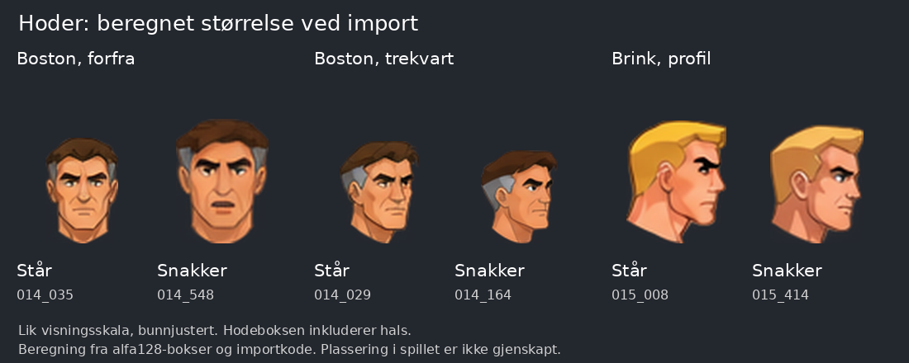
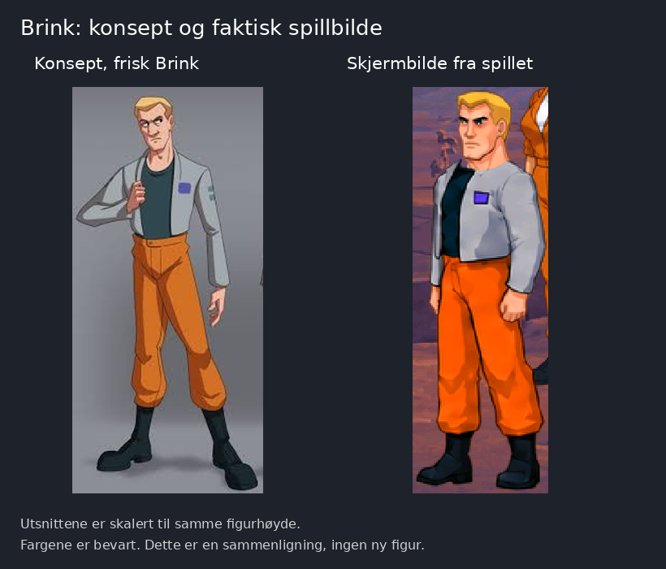

# Hodeplassering, størrelseshopp og Brinks utseende

Dato: 10. oktober 2026. Vurdering etter Toms seks faktiske skjermbilder. Dette er en feilrapport og stilvurdering. Ingen spillkode, jobbfiler eller leverte figurer er endret.

Tillegg etter et syvende skjermbilde: [Firkantede rester rundt figurene](ARTEFAKTER.md). Tydelige blokker ved Maggie, Boston og Brink er dokumentert med utsnitt og konkrete kontrollpunkter for skalering, originalpiksler og oppdatering mellom animasjonsfaser.

## Konklusjon

Toms observasjon har et konkret grunnlag. Hodegrafikken og den nåværende skaleringsregelen gir forskjellig hodestørrelse mellom ståing og tale, avhengig av retning. Plasseringen ved halsen bør kontrolleres sammen med størrelsen. Brink avviker dessuten fra karakterkonseptet i farger, ansikt og kroppsbygning.

Bildet viser faktiske leverte tegninger skalert med den beregnede gruppefaktoren fra importen. Alle er vist med samme forstørrelse og bunnjustert for sammenligning. Dette gjenskaper ikke plasseringen i spillet. Boksene inkluderer hals, og prosentene nedenfor er boksutstrekninger, ikke en måling av selve skallen.

## Hoder: hva som er kontrollert

Kildekode: `origin/main`, commit `4cff08145f0760d9e7765bcec6f6c9a371e196bb`, `pipeline/dighd/myk.py`.

- Linje 324-358: skalaen beregnes for hver gruppe med samme animasjon, lag og rad på det enkelte arket. Ståhoder og snakkehoder deler ikke en felles kalibrering. En sammenhengende taleserie fordelt over flere rader kan også få ulike skalaer.
- Linje 277-288: høydeforholdet bygger på alfa-boksens høyde og prioriterer originalruter med høyde minst 12. En rad med flere retninger kan dermed få skala fra noen av hodene. Halslengde og munnåpning inngår i høyden.
- Linje 231-242 og 203-218: hver rute plasseres separat ved å søke etter best omrissoverlapp med originalen. Det finnes ikke et felles anatomisk feste ved halsen i denne funksjonen. Dette er en mulig årsak til vandrende hodeplassering; faktisk bevegelse er ikke gjenskapt fra skjermbildene.
- Linje 375-377 og 385-391: ruter merket `sjekk` skrives fortsatt til modden. God boksdekning dokumenterer ikke stabilt ansikt eller riktig forbindelse til kroppen.

Beregningen bruker `fig014_01` til `fig014_03` og `fig015_01` til `fig015_03`, originale metadata og de leverte alfa128-boksene. Den bruker kodens faktiske `_rows` og `sheet_scale`. Boksens sentrum brukes ved radgrupperingen; dette er en beregning fra rutekartet, ikke en full kjøring av komponentuttrekk og import. Rutene har tydelig atskilte rader. Boston ark 01 har ikke rutekart i samme format, så de 28 registrerte komponentene i `ark-kontroll.json` er koblet til de 28 originalrutene etter rad og rekkefølge.

Eksempler, beregnet størrelse i HD-piksler før eventuell skalering av hele skuespilleren:

| Figur og retning | Står | Snakker, median i serien | Forskjell |
| --- | --- | --- | --- |
| Boston forfra, retning 4 | 29,33 x 42,67 | 38,19 x 52,40 | ca. 30 % bredere og 23 % høyere boks |
| Boston trekvart, retning 3 | 32,00 x 41,33 | 30,29 x 37,14 | ca. 5 % smalere og 10 % lavere boks |
| Boston trekvart, retning 5 | 34,00 x 42,00 | 29,35 x 36,00 | ca. 14 % smalere og lavere boks |
| Brink profil, retning 2 | 40,44 x 49,78 | 36,98 x 48,00 | ca. 9 % smalere boks |

Full oversikt med rutenavn, innmålte bokser og skalaer: [hodemaaling.json](hodemaaling.json).

Dette underbygger et størrelseshopp ved overgang mellom animasjoner. Det beviser ikke at hodet zoomer kontinuerlig under en bestemt replikk. Variasjon innen taleseriene finnes også i tegningene og noen serier får flere skalaer, men munn og kjeve kan naturlig endre silhuetten. Skalle, øyne og ører må følges over tid for å skille normal tale fra uønsket pulsering.

I skjermbilde 3 leses Bostons hode som lite i forhold til overkroppen, med en lang, smal forbindelse ved halsen. Skjermbildene har ulike utsnitt og skalaer. De er derfor ikke brukt som en direkte pikselmåling av animasjonen.

## Brink: stil og farger

Sammenlignet med den friske Brink i [karakterkonseptet](../hovedfigurer-hd-20261009/referanser/brink-konsept.jpeg):

- Buksene i spillet er mye mer lysende og mettede oransje. Konseptet har en dempet, brunere okertone.
- Håret leses som sterkere gult; konseptet har en mer dempet blond tone.
- Ansiktet har bredere kjeve, kraftigere bryn og et mer heroisk uttrykk. Konseptets Brink har et smalere, lengre og mer særpreget ansikt.
- Kroppen og skuldrene virker kraftigere og mer kompakte. Konseptet er slankere og mer langstrakt.
- Grå åpen jakke, mørk skjorte og lilla brystmerke er riktig grunnantrekk. Jakken leses lysere og kjøligere i skjermbildet, men nøyaktig fargetilpasning må kontrolleres i samme romlys.

Den sterke oransjefargen og det kraftige ansiktet finnes allerede i `jobber/fig015_01/resultat.png`. Det er derfor også et problem i illustrasjonen, ikke bare en hypotese om motorens fargetoning. Det genererte `brink-stilanker.png` er et mellomresultat og skal ikke overstyre karakterkonseptets identitet.

## Anbefalt retting og kontroll

1. Claude kalibrerer hodestørrelse per figur og retning på tvers av ståing, tale og ark. Bruk skalle, øye- og ørelinje til kalibrering. Hele alfa-boksens høyde er et dårlig mål når hals og munn varierer. Behold kroppens perspektivskalering fra originalspillet.
2. Fest hodet til et kontrollert punkt ved halsen. Bevar originalens tilsiktede hodebevegelse; ikke la uavhengig omrissoverlapp finne et nytt anatomisk feste for hver munnfase.
3. Kontroller én hel kropp med alle talehodene i en faktisk sekvens, inkludert overgang stå -> tale -> stå. Start med Boston forfra og trekvart, der beregningen viser tydelige forskjeller. Logg kostyme, rute, originalposisjon, importskala og forskyvning. Kontroller også Brink og Maggie før en generell retting godtas.
4. Grafikken for frisk Brink justeres mot konseptet med dempet okeroransje, dempet blondt hår, smalere ansikt og slankere kroppsbygning. Samme karaktermodell og farger må brukes i alle retninger og talehodene. Lag én sammenlignbar prøve før resten tegnes om.
5. Bekreft resultatet i samme rom og ved samme skuespillerposisjon. Øyne, ører, skalle og halsfeste skal være stabile når bare munnen animeres. Tale, timing og annen spillatferd skal bevares.

## Avgrensning og kildekontroll

- Seks brukerbilder er bevart uendret som `skjermbilde-01.png` til `skjermbilde-06.png`, med sjekksummer i [kilder.json](kilder.json).
- Skjermbildene identifiserer ikke kjørende bygg, importmanifest eller konkrete rutenumre. En bestemt rute er derfor ikke påstått identifisert i spillet.
- Originalmaskene i Boston-arkene ble kontrollert mot lokale uttrekk fra spillet: alle 217 ruter hadde samme alfaområde. Beregningen bruker originalenes synlige høyder fra `jobb.json`.
- Ingen full myk import, motorendring, sanntidsavspilling eller spilltest er utført i denne vurderingen. Sammenligningsbildene er diagnostiske utsnitt, ikke nye produksjonsfigurer.
- Grafikkgrunnlag før rapport: `0eb73f27ae90d759bea03fb053973639e7c49da4` på `gpt-arbeid`. Inngangsfilenes sjekksummer står i `kilder.json`.
